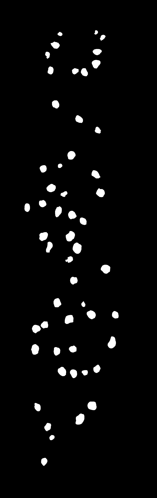
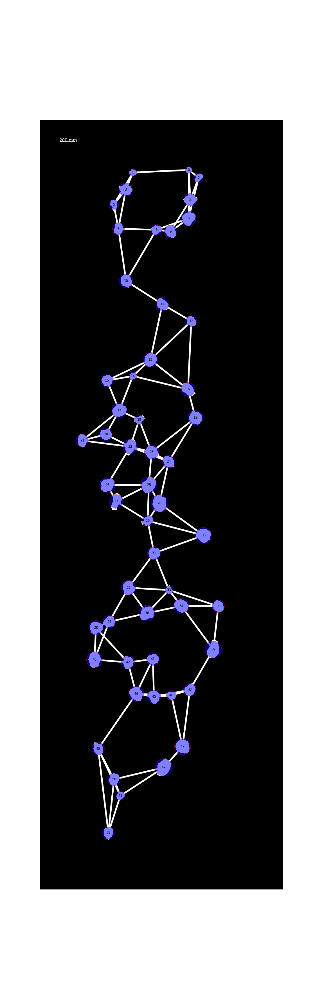
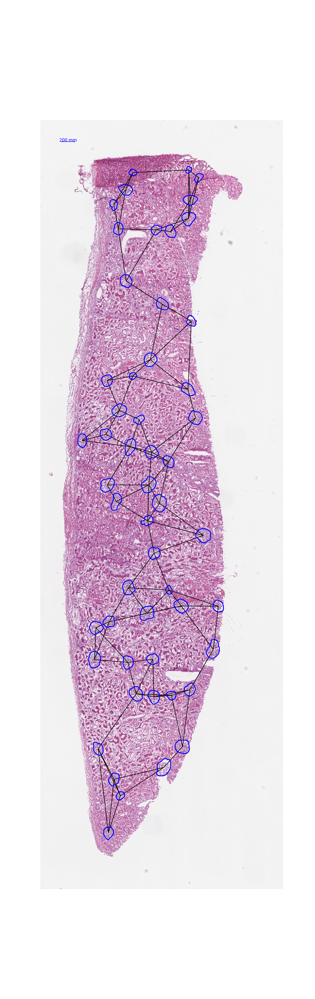

# myGraph: Generate graph using mask image, plot the graph both on the mask image and raw image.

## Introduction

An example mask image.


An example raw image.


The graph on the mask image.


The graph on the raw image.

## Requirements
-   python 3.7.7
-   matplotlib==3.1.3
-   networkx==2.3
-   numpy==1.16.4
-   scikit-image==0.15.0
-   scikit-learn==0.21.2

You can install them manually or run:
 ```angular2html
cd myGraph/code
pip3 install -r requirements.txt
```

## Usage
Prerequisite: raw images and mask images
1. Clone the repository. The folders are in the following structure:
```
├── myGraph
|     ├── code
|         ├── drawGraph
|             ├──__init__.py
|             ├──DrawGraph.py
|             ├──DrawGraphSettings.py
|         ├──main.py
|         ├──requirements.txt
|
|     ├── image
|         ├── graph
|              ├──mask
|                 ├──exampleGraphOnMask.png (Your generated graph on the mask image will be here.)
|              ├──raw
|                 ├──exampleGraphOnRaw.png (Your generated graph on the raw image will be here.)
|
|         ├── raw(put the raw images into this folder)
|              ├──example.png (The raw image must have the same name with the mask image for the same instance.)
|
|         ├── mask(put the mask images into this folder)
|              ├──example.png (The mask image must have the same name with the raw image for the same instance.)

 ```
2. Put your dataset into the conresponding folders. You can adjust some parameters in myGraph/code/drawGraph/DrawGraphSettings.py. Generate the graph using the following commands:
 ```angular2html
cd myGraph/code
python main.py
```

